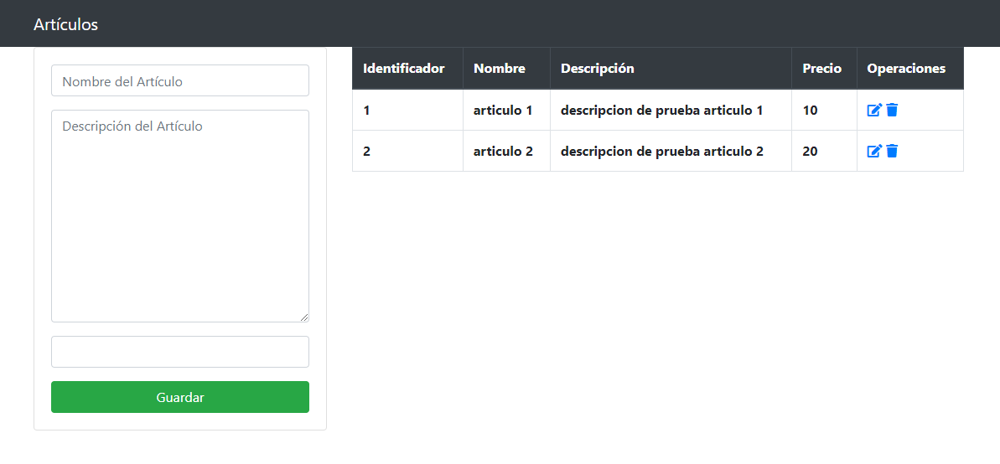
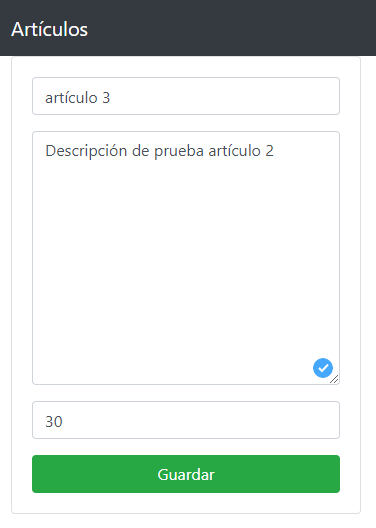
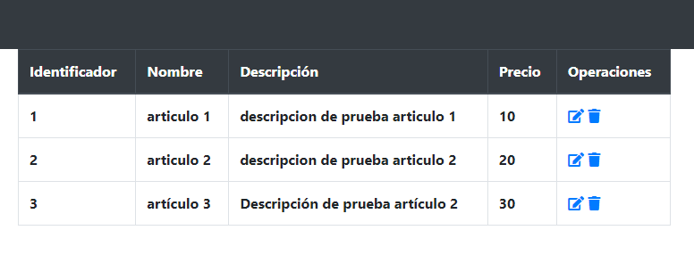
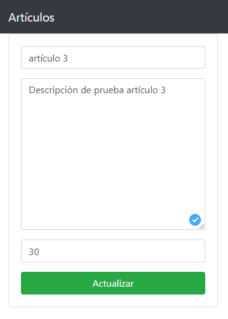
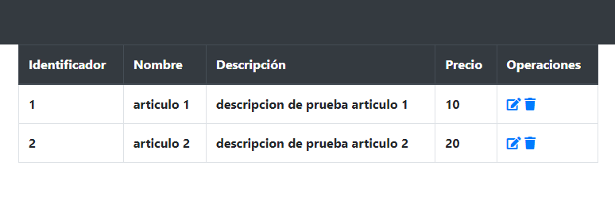

# CRUD de un Artículo
Sistema CRUD de un artículo con PHP y MySQL, donde se puede registrar, listar, actualizar y eliminar un artículo con datos como su nombre, descripción y precio. **03/05/2021**

<strong>Imagen:</strong> Página de Inicio.

## Registrar (Create)

<strong>Imagen:</strong> Registrar artículo.

## Listar (Read)

<strong>Imagen:</strong> Listar artículos.

## Actualizar (Update)

<strong>Imagen:</strong> Actualizar artículo.

## Eliminar (Delete)

<strong>Imagen:</strong> Eliminar artículo.

